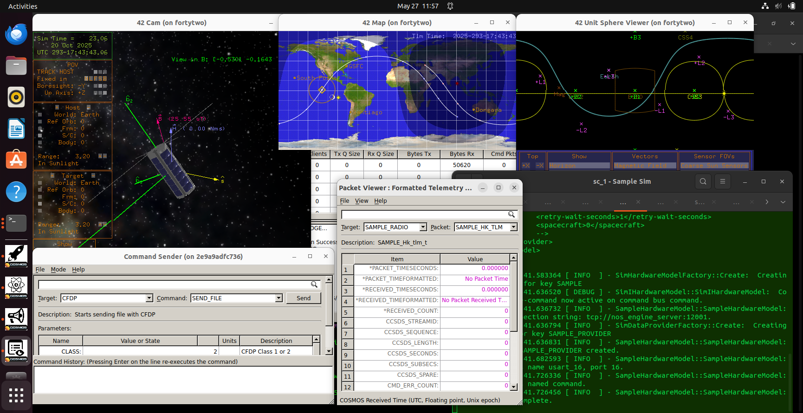

# Scenario - Demonstration

This scenario was developed to provide an overview of the NASA Operational Simulator for Small Satellites (NOS3).
It demonstrates the flight software (FSW), ground software (GSW), and simulation interactions within NOS3.
It also serves as a template for additional scenarios to be developed and added to the environment to cover various use cases.

This scenario was last updated on 05/26/2025 and leveraged the `dev` branch at the time [a3e7c100].

## Learning Goals

By the end of this scenario, you should be able to:
* Run NOS3 including FSW, GSW, and simulators.
* Send commands and receive telemetry using COSMOS.
* Interact with a simulated hardware component.
* Verify successful interaction between FSW, GSW, and simulators.
* Understand the basic architecture of a NOS3 scenario.

## Prerequisites

Before running the scenario, complete the following steps:
* [Getting Started](./NOS3_Getting_Started.md)
  * [Installation](./NOS3_Getting_Started.md#installation)
  * [Running](./NOS3_Getting_Started.md#running)

No additional file changes or special setup is needed for this scenario.

## Walkthrough

With a terminal navigated to the top level of your NOS3 repository:
* `make`

* `make launch`

* Organize the windows for ease of use:

Now, we start the COSMOS ground software:
* Click the `OK` button, followed by the `COSMOS` button in the top left of the NOS3 Launcher window that appears.
* Note you may minimize this NOS3 Launcher, but do not close it.

By default, we go to sun-safe mode.  We should be able to confirm that in multiple ways:
* In the FSW console:
  * Lots of logs get captured here as events occur during startup, so you may need to scroll back in that terminal to view the message.
  * Console prints should calm down after initialization as the spacecraft reaches a steady state.
* In GSW telemetry:
  * The COSMOS Packet Viewer lets you select the desired Target and Packet and see what has been reported.
  * If the text is displayed as pink, that means that either no data has been received or that the data has gone stale.
* Visually in 42:
  * Note you can click and drag within the 42 Cam window to rotate around the spacecraft.

---
### Commanding the Spacecraft

Let's confirm we can command the spacecraft:
* The CFS CFE_ES_NOOP command has a nice print to the FSW console which will allow us to easily confirm this.
  * You may need to return the FSW console back to the bottom of the window to see it.
* Additionally, we can confirm (via inspection) that the command counter belonging to that specific application increments in telemetry:

* Note the previous command was sent via the DEBUG interface:
  * In the above image you can see this in the `Bytes Tx` column of the COSMOS Command and Telemetry Server.
  * This DEBUG interface mimics being physically plugged into the spacecraft.  This is useful for development and test, but not realistic.

Let's command the radio to transmit:
* It is common that the spacecraft radio is always listening for commands, but doesn't transmit unless enabled.
* In the Command Sender, let's change to use the CFS TO_ENABLE_OUTPUT command:
  * The default arguments of DEST_IP 'radio_sim' and DEST_PORT '5011' work for this.

* Note that while we are getting `Bytes Rx` in the COSMOS Command and Telemetry Server, we don't have `Bytes Tx`.
* This is because that standard CFS target utilizes the debug interface.

Let's send another NOOP, but use the CFS_RADIO target:

[Scenario Demo - Radio Command](./_static/scenario_demo/scenario_demo_radio_command.png)

* Things look as expected now in the COSMOS Command and Telemetry Server.

Let's confirm that we're actually getting radio telemetry which matches the debug interface:
* Open another Packet Viewer window via the COSMOS NOS3 Launcher (third row, first column).

---
### The Sample Component

Let's see if we can command the sample instrument payload:
* This is a standard NOS3 component, meaning it has FSW, GSW, and a simulator running and talking to the 42 dynamics provider.
* Using the drop-down carrot on the right of the terminal window, change the terminal tab to `sc_1 - Sample Sim` and resize.
* Also, prepare the packet viewer by changing to the SAMPLE SAMPLE_HK_TLM packet, and send the SAMPLE SAMPLE_NOOP_CC via the Command Sender.

* We can confirm that the command was sent successfully in both the FSW console and by observing an increase in the CMD_COUNT, but nothing appears in the simulator:
  * This is because of the NOOP or No Operation command itself.
  * NOOPs are standard across cFS applications and simply prove that that application is alive and listening.
  * These NOOP commands do not interface with anything but the FSW application, however.
* Looking at the sample HK telemetry, you may have noticed it has series of `DEVICE_*` telemetry points:
  * These are specifically relating to the application talking to the device itself.

Before enabling the sample instrument, the data in the Packet Viewer will show up as pink.  This indicates that either no data has been received, or that the data is old and 'stale':

Let's enable the sample application and see what happens.

* The sample simulator is now communicating with the sample application:
  * The sample application has a scheduled rate at which it requests data from the device.
* This is cool, but let's break some stuff:
  * Change to the SIM_CMD_BUS_BRIDGE Target in the Command Sender.
  * This interface enables us to command the simulators directly so we can see how flight software would respond.

Let's send the SAMPLE_SIM_SET_STATUS command with a status value of 5.

* We successfully told the sample simulator to change its status to 5:
  * We see in the sample sim that it received the command to change status.
  * The FSW console shows `Device disabled successfully` and `Request device data reported status error 5`.
  * If you dive into the [sample component readme](https://github.com/nasa-itc/sample/blob/275edcf55cf5b1d7d0c3e0c4978927b5814529a7/README.md) you can figure out why!

---
### ADCS

We can leave sample like that - let's play with the Attitude Determination and Control System (ADCS).
* In short, ADCS uses various components (typically referred to as sensors and actuators) to make the vehicle change orientation.
Let's first disable the ADCS from doing anything so we can play:
* Note that if you are in eclipse your spacecraft can't point at the sun because it doesn't know where it is (not smart enough to guess). 
* In the Command Sender send the GENERIC_ADCS GENERIC_ADCS_SET_MODE_CC with GNC_MODE PASSIVE (0).

* The spacecraft appears to be tumbling around more, which can be seen in the 42 Cam:
  * Note that it is important to command ADCS to passive so that we can poke at the various components it leverages.
  * ADCS requests telemetry and sends new commands to these components at 1Hz so it would fight us otherwise.

Let's command a reaction wheel to spin and see if it does stuff:

Looks like it! 

Let's send a negative torque and see if you can get the spacecraft stable in that axis:

* Close, but this is really tough to do manually.

If we happen to be in the sun again, let's turn ADCS back on and see if it finishes the job for us:
* Send the GENERIC_ADCS GENERIC_ADCS_SET_MODE_CC with GNC_MODE SUNSAFE_MODE (2).

If you've made it this far, congratulations! 
You are now a NOS3 spacecraft operator.
